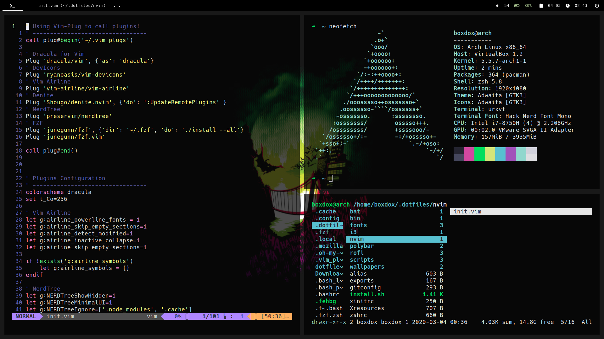
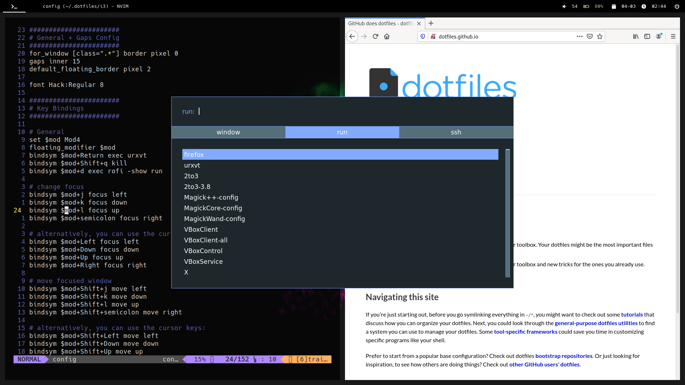

# Dotfiles

Dots for i3-gaps, urxvt, polybar, neovim, zsh, rofi, ranger etc. Optimized for
maximum productivity!




## Installation

Preferably, run this over a fresh ArchLinux install, with base packages (see below):

```
git clone https://github.com/boxdox/dotfiles ~/.dotfiles
cd ~/.dotfiles
chmod +x install.sh
./install.sh
```

The script takes care of backing up your existing dots
and symlinking the rest from the `.dotfiles` directory.

If for some reason, you clone this repo with a different name,
edit the directory name in the following files: `install.sh`
and `zshrc`

### Arch Fresh Installation:

1. Follow the installation guide and create a user in sudoers group
2. Install the following packages for base:

```
sudo pacman -Sy xorg-server xorg-xinit xorg-xrandr
```

3. Proceed to clone the repo and run installer script.

_Note: For some reason, `dhcpcd` is not installed,
Install that before proceeding_

### Todo

    - [] Add Tmux
    - [] Configure vim-airline

### Licence

[MIT](https://boxdox.mit-license.org/)
